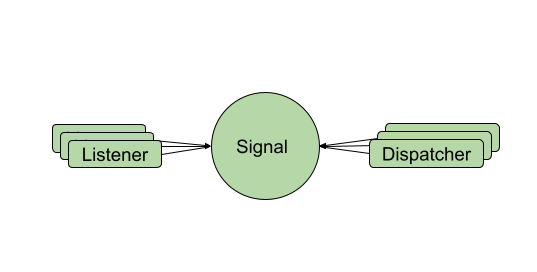

# signals

[](https://jitpack.io/#gazman-sdk/signals)

A Signal is a way to decouple between a subject(dispatcher) and the observers(listeners) in distributed event handling systems.



# Setup
Step 1. Add it in your root build.gradle at the end of repositories:

	allprojects {
		repositories {
			...
			maven { url 'https://jitpack.io' }
		}
	}
Step 2. Add the dependency

	dependencies {
	    implementation 'com.github.gazman-sdk:signals:v1.3'
	}

# Kotlin example

```kotlin
fun interface Chat{
    fun onNewMessage(s:String)    
}

class Foo{
    val chatSignal = Signals.signal(Chat::class)
    
    fun bar(){
        chatSignal.addListener { s-> Log.d("chat", s) } // logs all the messaged to Logcat
    }
}

class Foo2{
    val chatSignal = Signals.signal(Chat::class)
    
    fun bar2(){
        chatSignal.dispatcher.onNewMessage("Hello from Foo2") // dispatches "Hello from Foo2" message to all the listeners
    }
}
```

# Java example

```Java
interface Chat{
    void onNewMessage(String s);    
}

class Foo{
    Signal<Chat> chatSignal = Signals.signal(Chat.class);
    
    void bar(){
        chatSignal.addListener( s-> Log.d("chat", s) ); // logs all the messaged to Logcat
    }
}

class Foo2{
    Signal<Chat> chatSignal = Signals.signal(Chat.class);
    
    void bar2(){
        chatSignal.dispatcher.onNewMessage("Hello from Foo2"); // dispatches "Hello from Foo2" message to all the listeners
    }
}
```

The Signal is automatically created from the `Chat` interface. It allows `Foo` to register for it and `Foo2` to dispatch new messages without interaction.

# Signal API

## Register/Unregister listeners

 - `addListener(listener)` - registers a listeners for this signal  
 - `addListenerOnce(listener)` - registers a listeners for this signal and unregister it after the first dispatch
 - `removeListener(listener)` - removes a listener that was registered using one of the methods above

## Dispatch events

 - `dispatcher` - property from the interface-type used to create this Signal. 
   When it is invoked, it is propagating to all the listeners.
 - `setInvoker(executor/handler)` - by default, all the listeners, will be executed synchronously over the dispatcher thread. You can change this behavior by using an explicit executor/handler to execute all the calls for listeners

## SignalsHelper

A helper class to unregister all the signals at once. 

 - `addListener(class, listener)` 
 - `addListenerOnce(class, listener)` 
 - `removeListener(class, listener)`
 - `removeAll()` - Removes all the listeners registered via this SignalsHelper
 
## G

`G` is a super light utility class to simplify the work with Signals.

 - `G.app` - app context. It is **automatically** obtained via a `ContentProvider` during the Application creation
 - `G.main` - Main handler
 - `G.IO` - A single threaded executor
 - `G.CE` - A multithreaded cached executor
