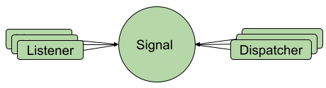

# signals

A signal is a way to decouple between a subject(dispatcher) and the observers(listeners) in distributed event handling systems.



# Kotlin

```kotlin
fun interface Chat{
    fun onNewMessage(s:String)    
}

class Foo{
    val chatSignal = Signals.signal(Chat::class)
    
    fun bar(){
        chatSignal.addListener { s-> Log.d("chat", s) } // logs all the messaged to Logcat
    }
}

class Foo2{
    val chatSignal = Signals.signal(Chat::class)
    
    fun bar2(){
        chatSignal.dispatcher.onNewMessage("Hello from Foo2") // dispatches "Hello from Foo2" message to all the listeners
    }
}
```

# Java 

```Java
interface Chat{
    void onNewMessage(String s);    
}

class Foo{
    Signal<Chat> chatSignal = Signals.signal(Chat.class);
    
    void bar(){
        chatSignal.addListener( s-> Log.d("chat", s) ); // logs all the messaged to Logcat
    }
}

class Foo2{
    Signal<Chat> chatSignal = Signals.signal(Chat.class);
    
    void bar2(){
        chatSignal.dispatcher.onNewMessage("Hello from Foo2"); // dispatches "Hello from Foo2" message to all the listeners
    }
}
```

The signal is automatically created from an interface. It allows to add listeners and dispatch the signal.

# Signal API

## Register/Unregister listeners

 - addListener(listener) - registers a listeners for this signal  
 - addListenerOnce(listener) - registers a listeners for this signal and unregister it after the first dispatch
 - removeListener(listener) - removes a listener that was registered using one of the methods above

## Dispatch events

 - `dispatcher` - a property from the interface-type used to create this Signal. 
   When it being invoked it is propagating to all the listeners.
 - setInvoker(executor/handler) - by default all the listeners will be executed synchronously over the dispatcher thread
   this can be changed by using an explicit executor/handler to execute all the calls for listeners

## SignalsHelper

A helps class to unregister all the signals at once. 

 - addListener(class, listener) 
 - addListenerOnce(class, listener) 
 - removeListener(class, listener)
 - removeAll() - Removes all the listeners registered via this SignalsHelper
 
## G

G is a super light utility class to simplify the work with Signals

 - G.app - app context. It is automatically obtained via a ContentProvider during Application creation
 - G.main - Main handler
 - G.IO - A single threaded executor
 - G.CE - A multithreaded cached executor